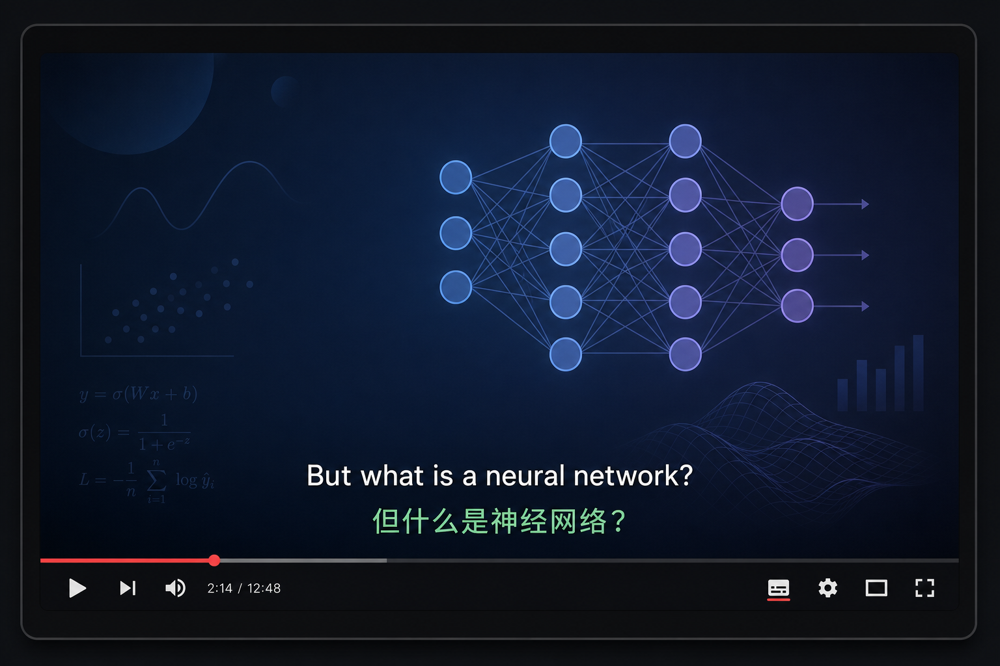
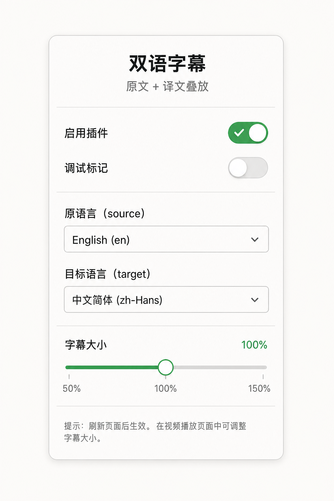

# YouTube 双语字幕

在 YouTube 播放器中**同时显示原文和译文**的浏览器扩展（Chrome / Safari）。

[](./manifest.json)
[](./LICENSE)
[](#一分钟安装-chrome)
[](#safari-调试)

<p align="center">
  
</p>

<p align="center">
  
</p>

> 示意图示意叠放位置与设置项；安装后请以真实 YouTube 播放页为准。可随时用实拍图替换 `docs/screenshots/`。

## 一分钟安装（Chrome）

```bash
git clone https://github.com/TAOMA-06/youtube-bilingual-captions.git
```

1. 打开 `chrome://extensions/`
2. 开启「开发者模式」
3. 点击「加载已解压的扩展程序」
4. 选择本仓库根目录（含 `manifest.json`）
5. 打开任意带字幕的 YouTube 视频

默认语言：**English → 简体中文**。

## 功能亮点

- 原文 + 译文双行叠放
- 支持人工字幕与自动生成字幕
- 无独立译轨时自动走 YouTube `tlang` 翻译
- 按时间重叠 / 最近中点对齐双轨
- 广告结束后自动加载；站内切视频无需整页刷新
- 弹窗可调字幕大小（50%–400%）并即时热更新
- 兼容 Chrome Manifest V3 与 Safari Web Extension

## 界面说明

点击工具栏扩展图标：

| 选项 | 作用 |
| --- | --- |
| 启用插件 | 开 / 关双语字幕 |
| 调试标记 | 右上角显示轨道状态与字幕条数 |
| 原语言 | 原文字幕语言（默认 English） |
| 目标语言 | 译文字幕语言（默认简体中文） |
| 字幕大小 | 50%–400% 滑杆调节 |

播放器中显示顺序：

```text
Original English subtitle
简体中文译文
```

## 隐私

扩展不连接自有服务器，不上传观看记录或字幕内容。语言与开关仅保存在浏览器扩展存储中。

## 已知限制

- 依赖 YouTube 播放器与 timedtext 内部接口，站点改版后可能需更新
- 无字幕、直播、会员 / 版权限制视频可能无法显示
- ASR 与译轨切分不一致时，少数句子可能有轻微时间偏差
- Safari 需经 Xcode 转换、签名后再安装

## Safari 调试

```bash
xcrun safari-web-extension-converter "/path/to/youtube-bilingual-captions" \
  --project-location "/path/to/output" \
  --app-name "YouTubeBilingualCaptions" \
  --bundle-identifier "com.example.yt-bilingual-captions"
```

在 Xcode 中运行宿主 App，再到 Safari 「设置 → 扩展」启用。

## 工作原理

1. `page-bridge.js` 在页面主世界读取播放器响应与字幕轨
2. 复用播放器 Proof-of-Origin Token 请求 timedtext
3. 优先 JSON3，失败回退 WebVTT
4. 按时间重叠或最近中点对齐原文 / 译文
5. 根据 `video.currentTime` 在播放器内渲染双行字幕

## 实测状态

`0.3.0` 已在 Chrome 真实 YouTube 播放页验证：英文 + 简体中文对齐显示，广告结束后可自动加载。

## 项目结构

```text
.
├── manifest.json
├── LICENSE
├── background/
│   └── service-worker.js
├── content/
│   ├── page-bridge.js
│   ├── youtube-bilingual.js
│   └── youtube-bilingual.css
├── popup/
│   ├── popup.html
│   ├── popup.css
│   └── popup.js
├── docs/screenshots/
└── icons/
```

## 开发检查

```bash
node --check content/youtube-bilingual.js
node --check content/page-bridge.js
node --check background/service-worker.js
node --check popup/popup.js
```

## License

[MIT](./LICENSE)
